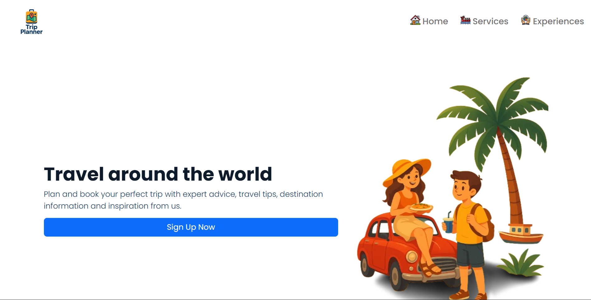
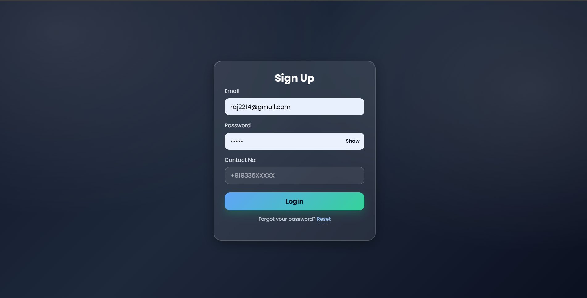
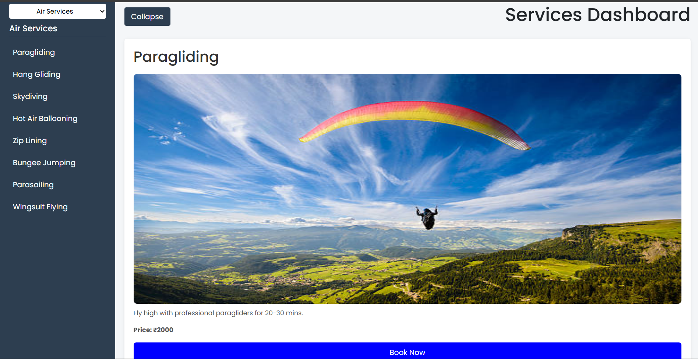

# ✈️ TripPlanner — Travel & Adventure Web App

**TripPlanner** is a full-stack **MERN (MongoDB, Express, React, Node.js)** based travel planning web application that helps users explore destinations, book hotels and flights, and discover exciting adventure activities and experiences.

The platform allows travelers to plan trips easily by exploring **air, water, and land adventures**, discovering new cities, trying unique experiences, and managing bookings in one place.

---

## 🌍 Features

### 🏠 Travel Planning

* Explore popular cities and destinations
* Discover new travel experiences
* Personalized trip exploration

### 🪂 Adventure Services

Users can explore multiple adventure categories:

* ✈️ **Air Adventures** – Paragliding, Skydiving
* 🌊 **Water Adventures** – Water sports & activities
* 🏔️ **Land Adventures** – Trekking, Camping, Safari
* 🎯 Unique Experiences & Activities

### 🍽️ Experiences

* Local food experiences
* Cultural activities
* New things to try while traveling

### 🏨 Booking System

* Hotel booking
* Flight booking
* Travel service browsing

### 🔐 Authentication

* User Signup & Login
* Secure authentication system

---

## 🧱 Tech Stack

### Frontend

* React.js
* CSS / Tailwind
* Axios

### Backend

* Node.js
* Express.js

### Database

* MongoDB (Mongoose)

### Authentication

* JWT Authentication

---

## 📸 Application Screenshots

### 🏠 Home Page



---

### 🔐 Signup Page



---

### 🪂 Services Page



---

### 🎯 Experiences Page


---

## 📂 Project Structure

```
TripPlannerApp/
│
├── client/          # React Frontend
├── server/          # Node + Express Backend
├── screenshots/
│   ├── home.png
│   ├── signup.png
│   ├── services.png
│   └── experiences.png
│
├── .env
├── package.json
└── README.md
```

---

## ⚙️ Environment Variables

Create a `.env` file inside the server folder:

```
PORT=5000
MONGO_URI=your_mongodb_connection
JWT_SECRET=your_secret_key
```

⚠️ Do not upload `.env` to GitHub.

---

## 🛠️ Installation & Setup

### 1️⃣ Clone Repository

```bash
git clone https://github.com/rajsrivastav344/TripPlannerApp.git
cd TripPlannerApp
```

---

### 2️⃣ Install Backend Dependencies

```bash
cd server
npm install
```

---

### 3️⃣ Install Frontend Dependencies

```bash
cd ../client
npm install
```

---

### 4️⃣ Run Backend Server

```bash
npm run dev
```

---

### 5️⃣ Run Frontend Application

```bash
npm start
```

---

## ▶️ Usage

1. Open browser:

```
http://localhost:3000
```

2. Create an account or login.
3. Explore services and experiences.
4. Discover destinations and adventures.
5. Book hotels and flights.

---

## 🚀 Key Modules

| Module         | Description                               |
| -------------- | ----------------------------------------- |
| Home           | Travel overview and featured destinations |
| Services       | Air, Water & Land adventure activities    |
| Experiences    | Food, cities & new travel experiences     |
| Booking        | Hotel & Flight booking                    |
| Authentication | Secure login & signup                     |

---

## 🤝 Contributing

1. Fork the repository
2. Create a new branch
3. Commit your changes
4. Open a Pull Request

---

## 📄 License

MIT License

---

## 👨‍💻 Author

Developed using **MERN Stack Technology** ❤️

⭐ Star this repository if you like the project!
